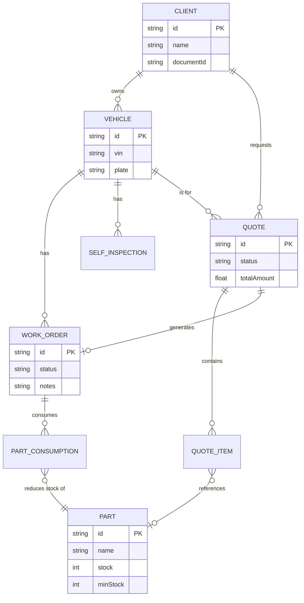
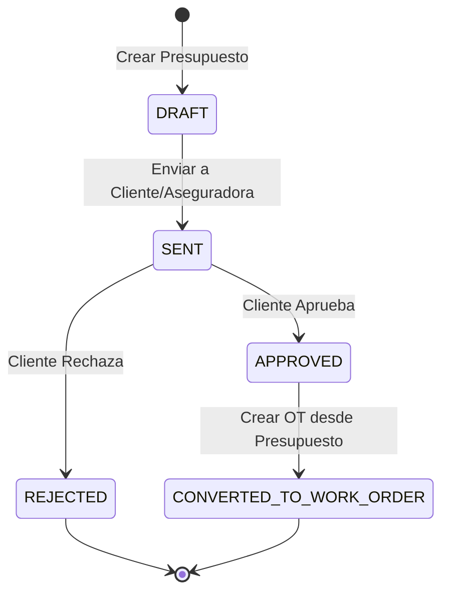

# Arquitectura MVP MecaniaOS

## Decision principal

Se adopta un **monolito modular** con `Next.js` como frontend y backend del MVP. La razon es simple: permite entregar rapido el flujo completo del taller sin duplicar capas ni infraestructura, y deja una separacion clara por dominio para extraer servicios mas adelante si el negocio lo requiere.

## Capas

- `src/app`: rutas UI, layouts y route handlers HTTP.
- `src/modules`: logica por dominio, validacion, repositorios y servicios.
- `src/lib`: utilidades transversales, auth base, errores, Prisma y helpers.
- `prisma`: esquema, seeds y evolucion del modelo de datos.

## Modulos iniciales

- `auth`
- `clients`
- `vehicles`
- `work-orders`
- `service-history`
- `dashboard`
- `self-inspections`
- `inventory` (En curso - Sprint 2)
- `quotes` (En curso - Sprint 2)

## Principios

- Validacion de entrada con `Zod`.
- Cada modulo expone `schemas`, `repository` y `service`.
- Las rutas HTTP no contienen reglas de negocio.
- Los cambios de estado de orden se registran en una tabla de historial.
- La UI protegida usa componentes server-first con formularios ligeros.

## Estructura de carpetas

```text
.
|-- docs/
|-- prisma/
|   |-- schema.prisma
|   `-- seed.ts
|-- src/
|   |-- app/
|   |   |-- api/
|   |   |-- login/
|   |   `-- (protected)/
|   |-- components/
|   |   |-- layout/
|   |   `-- ui/
|   |-- lib/
|   `-- modules/
|       |-- auth/
|       |-- clients/
|       |-- vehicles/
|       |-- work-orders/
|       |-- service-history/
|       `-- dashboard/
|-- .env.example
`-- README.md
```

## Extensibilidad prevista

Los siguientes modulos pueden agregarse posteriormente:

- `evidence` (integrado via storage de Self-Inspection)
- `customer-portal`

## Modelos y Relaciones (Sprint 2 - UML)

### Diagrama Entidad-Relacion (Core y Sprint 2)



### Ciclo de Vida de Presupuestos (State Machine)


